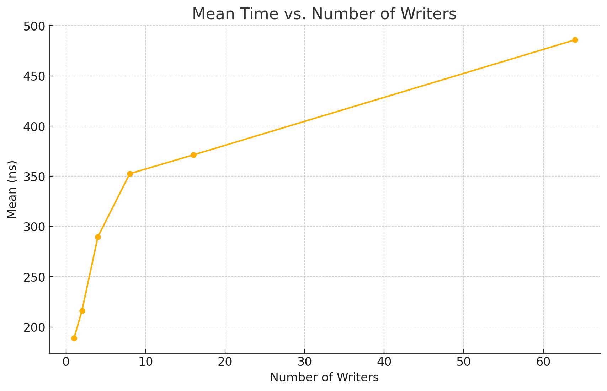

## Idea

There is one circular buffer indexed by sequence number & (NUM_NODES - 1) and a contiguous piece of memory 
that is reserved on each reserve.

Have a node containing the state of the cell if it is reserved, commited or empty.
For each cell I store the pointer after being reserved.

## Measurement
My machine has 10 cores, I could not disable the hyperthreading because the machine is locked.
On the benchmarking side, I could have used Google benchmark. In my experience Google benchmark is not very trustful for multithreading code, so I preferred to have an internal clock class defined which uses the performance counters and counts the number of cycles and converts into time.

Further details are the in the following presentation: [Microbenchmarking C++ code](https://www.youtube.com/watch?v=Czr5dBfs72U&t=852s)

### Single Reservation

Experiment with 5000 number of events per writer.

If the writers keep flooding the queue the latency is clearly high, so the idea to have a more realistic measure is avoid that the writers flood the queue in a tight loop.

| NUMBER WRITERS | MEAN (ns) | MAX (ns) |
|----------------|-----------|----------|
| 1              | 188.868   | 2696     |
| 2              | 216.283   | 2578     |
| 4              | 289.702   | 2759     |
| 8              | 352.577   | 12837    |
| 16             | 371.31    | 10182    |
| 64             | 485.868   | 24153    |

