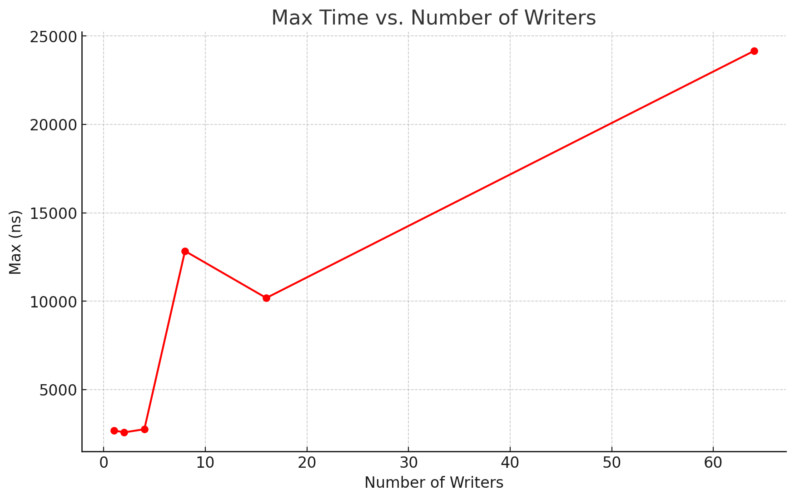

## Idea

There is one circular buffer indexed by sequence number & (NUM_NODES - 1) and a contiguous piece of memory 
that is reserved on each reserve.

Have a node containing the state of the cell if it is reserved, commited or empty.
For each cell I store the pointer after being reserved.

## Measurement
My machine has 10 cores, I could not disable the hyperthreading because the machine is locked.

### Single Reservation

Experiment with 5000 number of events per writer

| NUMBER WRITERS | MEAN (ns) | MAX (ns) |
|----------------|-----------|----------|
| 1              | 186.553   | 8529     |
| 2              | 186.553   | 8529     |
| 4              | 289.702   | 2759     |
| 8              | 352.577   | 12837    |
| 16             | 371.31    | 10182    |
| 64             | 485.868   | 24153    |

